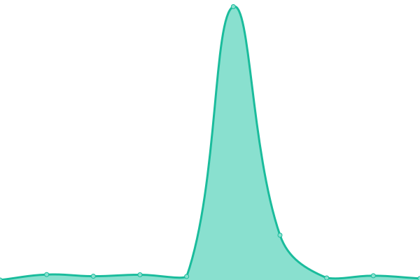

# [📈 Live Status](https://Paper319.github.io/Monitor): <!--live status--> **🟥 Complete outage**

This repository contains the open-source uptime monitor and status page for [Paper319](https://Paper319.github.io/Monitor), powered by [Upptime](https://github.com/upptime/upptime).

With [Upptime](https://upptime.js.org), you can get your own unlimited and free uptime monitor and status page, powered entirely by a GitHub repository. We use [Issues](https://github.com/Paper319/Monitor/issues) as incident reports, [Actions](https://github.com/Paper319/Monitor/actions) as uptime monitors, and [Pages](https://Paper319.github.io/Monitor) for the status page.

<!--start: status pages-->
<!-- This summary is generated by Upptime (https://github.com/upptime/upptime) -->
<!-- Do not edit this manually, your changes will be overwritten -->
<!-- prettier-ignore -->
| URL | Status | History | Response Time | Uptime |
| --- | ------ | ------- | ------------- | ------ |
|  PaperFin | 🟥 Down | [paper-fin.yml](https://github.com/Paper319/Monitor/commits/HEAD/history/paper-fin.yml) | 

 394ms
     
 | 

<a href="https://Paper319.github.io/Monitor/history/paper-fin">99.92%</a>
    

|  Account Login | 🟥 Down | [account-login.yml](https://github.com/Paper319/Monitor/commits/HEAD/history/account-login.yml) | 

 2929ms
     
 | 

<a href="https://Paper319.github.io/Monitor/history/account-login">99.93%</a>
    

|  Downloader | 🟥 Down | [downloader.yml](https://github.com/Paper319/Monitor/commits/HEAD/history/downloader.yml) | 

 2805ms
     
 | 

<a href="https://Paper319.github.io/Monitor/history/downloader">99.94%</a>
    

|  Movie Manager | 🟥 Down | [movie-manager.yml](https://github.com/Paper319/Monitor/commits/HEAD/history/movie-manager.yml) | 

 2849ms
     
 | 

<a href="https://Paper319.github.io/Monitor/history/movie-manager">99.95%</a>
    

|  Shows Manager | 🟥 Down | [shows-manager.yml](https://github.com/Paper319/Monitor/commits/HEAD/history/shows-manager.yml) | 

 2727ms
     
 | 

<a href="https://Paper319.github.io/Monitor/history/shows-manager">99.96%</a>
    

|  Request | 🟥 Down | [request.yml](https://github.com/Paper319/Monitor/commits/HEAD/history/request.yml) | 

 2873ms
     
 | 

<a href="https://Paper319.github.io/Monitor/history/request">99.97%</a>
    

|  Lookup Stuff | 🟥 Down | [lookup-stuff.yml](https://github.com/Paper319/Monitor/commits/HEAD/history/lookup-stuff.yml) | 

 2781ms
     
 | 

<a href="https://Paper319.github.io/Monitor/history/lookup-stuff">99.98%</a>
    

|  Subtitles | 🟥 Down | [subtitles.yml](https://github.com/Paper319/Monitor/commits/HEAD/history/subtitles.yml) | 

 2717ms
     
 | 

<a href="https://Paper319.github.io/Monitor/history/subtitles">99.99%</a>
    

|  Enocder | 🟥 Down | [enocder.yml](https://github.com/Paper319/Monitor/commits/HEAD/history/enocder.yml) | 

 2722ms
     
 | 

<a href="https://Paper319.github.io/Monitor/history/enocder">100.00%</a>
    

|  Cloud Files | 🟥 Down | [cloud-files.yml](https://github.com/Paper319/Monitor/commits/HEAD/history/cloud-files.yml) | 

 1094ms
     
 | 

<a href="https://Paper319.github.io/Monitor/history/cloud-files">100.00%</a>
    

|  McPanel | 🟥 Down | [mc-panel.yml](https://github.com/Paper319/Monitor/commits/HEAD/history/mc-panel.yml) | 

 739ms
     
 | 

<a href="https://Paper319.github.io/Monitor/history/mc-panel">100.00%</a>
    

<!--end: status pages-->

[**Visit our status website →**](https://Paper319.github.io/Monitor)

## 📄 License

- Powered by: [Upptime](https://github.com/upptime/upptime)
- Code: [MIT](./LICENSE) © [Anand Chowdhary](https://anandchowdhary.com), supported by [Pabio](https://pabio.com)
- Data in the `./history` directory: [Open Database License](https://opendatacommons.org/licenses/odbl/1-0/)
